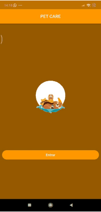
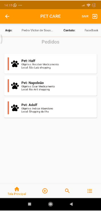
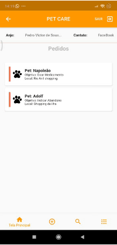

# PetCare

Uma aplicação voltada para ajudar donos de pets a conseguir medicamentos com outros donos, ou doar medicamentos que estão sobrando. O objetivo da aplicação é manter o registro de diversos donos de pets que precisem doar ou pedir medicamentos para os tratamentos de seus pets.  
  
## Tecnologias Usadas
Para a criação da aplicação, foram usadas as seguintes tecnologias:  
  
- Dart (Linguagem de Programação)
- Flutter (*Framework*)
- Android Studio (IDE)
- *FireBase* (Banco de Dados)
  
  
## Visão do Sistema
Abaixo, é possivel ter a visão do protótipo criado:  

###### Tela de Login

  

###### Pedidos

    
    
    

###### Navegador de Páginas (Bottom Navigator Bar)

    

